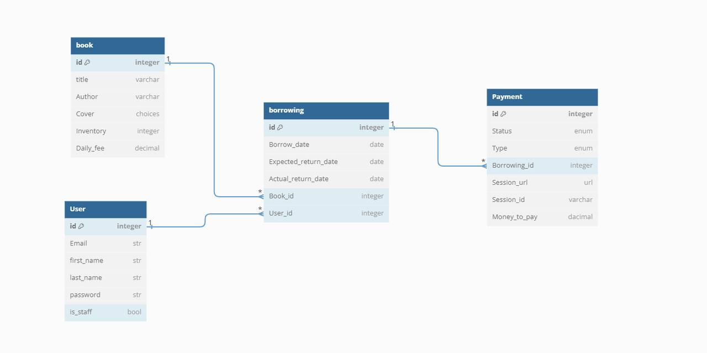

# Library API Service

Welcome to the Library API project!
This API is designed to manage the library work, where you can borrow some book but remember you have to get it back in time.

## Table of Contents

- [Features](#features)
- [Technologies Used](#technologies-used)
- [Getting Started](#getting-started)
  - [Prerequisites](#prerequisites)
  - [Installation](#installation)
- [API Endpoints](#api-endpoints)
- [DB Structure](#db-structure)

## Features

- Manage books and their details.
- Add images for books.
- User authentication through JWT token.
- Allow user to borrow just one book at a time after starting bot in Telegram.
- Notifications are sending through Telegram when borrowing book and book is overdue
- Payment through Stripe when borrowing book and after returning if book was overdue

## Technologies Used
* Django
* Django REST framework
* Django Q
* Docker
* JWT Authentication
* Stripe
* Swagger/OpenAPI Documentation
* Telegram Bot API


## Getting Started

### Prerequisites
* Python (version 3.6 or higher) and pip installed on your system
* Git (optional, for cloning the repository)


### Installation
To set up the Library API project follow these steps:
```shell
 git clone https://github.com/YKonoplyov/bravo_library_api_service.git
 cd bravo_library_api_service
 python -m venv venv
 venv\Scripts\activate
 pip install requirements.txt
 python loaddata library.json
 python manage.py migrate
 python manage.py runserver
```
## API Endpoints
```
"book":
    "books": "http://127.0.0.1:8000/api/airport/airplane_types/",
    
"borrowing":
    "borrowings": "http://127.0.0.1:8000/api/borrowing/borrowings/"
    
"payment":
    "payments": "http://127.0.0.1:8000/api/payment/payments/"
    "successed payment": "http://127.0.0.1:8000/api/payment/payments/success/"
    "cancelled payment": "http://127.0.0.1:8000/api/payment/payments/cancel/"

"user":
    "registration": "http://127.0.0.1:8000/api/user/register/"
	"token(login)": "http://127.0.0.1:8000/api/user/token/"
	"profile": "http://127.0.0.1:8000/api/me/"

"documentatoin": 
	"swagger": "http://127.0.0.1:8000/api/docs/" 
	"redoc": "http://127.0.0.1:8000/api/schema/"
```
## DB Structure


